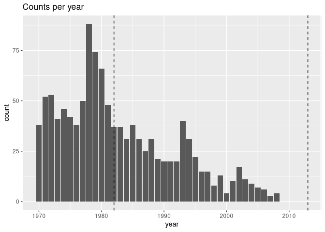
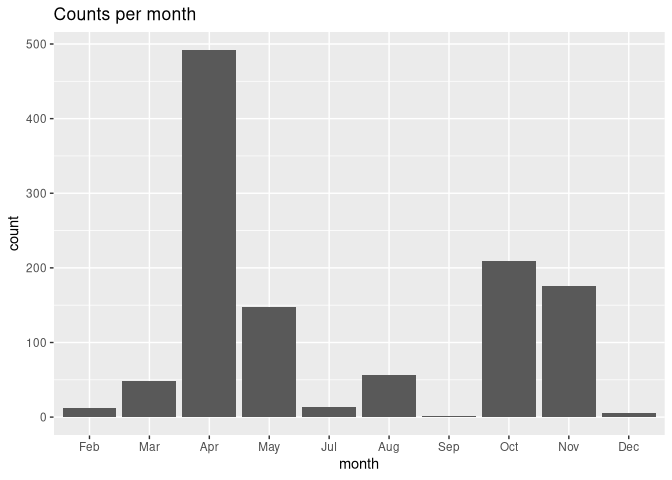
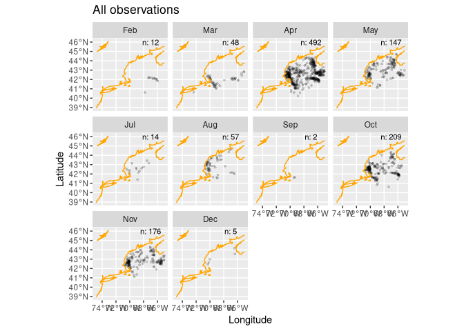
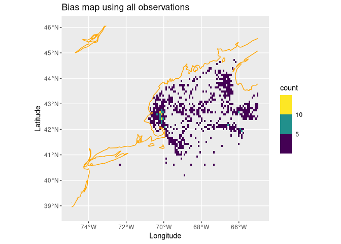
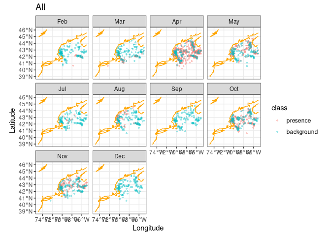
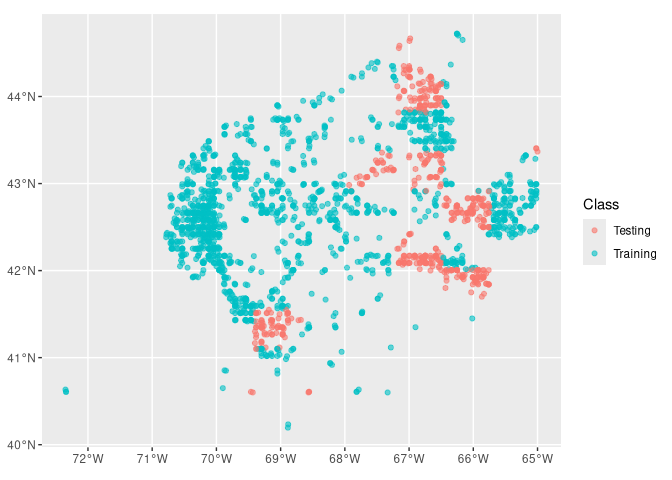
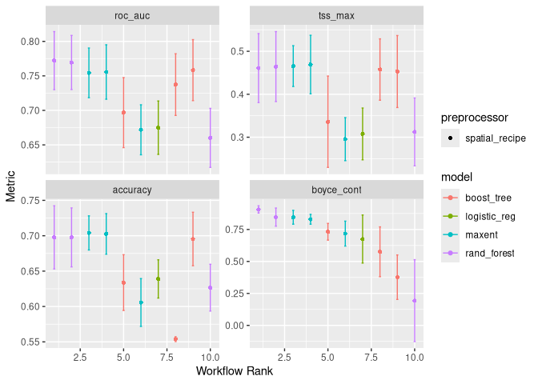

Brenner - Final Project
================

# The Present and Future of the Atlantic Wolffish in the Gulf of Maine

## Introduction

*Anarhichas lupus*, commonly known as the Atlantic Wolffish, is a large
carnivorous demersal fish that spends most of its life feeding on
benthic invertebrates such as crabs, scallops, urchins, and lobsters in
the Northern Atlantic Ocean (Bianucci et al.). Its position as a
secondary consumer helps prevent invasive species, like *Cancer maenas*
(green crabs), and grazers, like *Strongylocentrotus droebachiensis*
(green sea urchins), from overconsuming seagrass, making the wolffish a
fierce protector of the seagrass habitat. A generally sedentary species,
the wolffish inhabits rocky burrows and crevices, making it hard to find
in large trawl surveys such as the International Bottom Trawl Surveys
conducted in the spring and fall, leading to its classification as a
data-deficient species (Fairchild et al.).

Normally caught as bycatch, despite its minimal economic importance as a
fishery in the Gulf of Maine, attempts have been made to cultivate
wolffish populations for aquaculture. Found in temperatures ranging from
-1º to 10ºc, the wolffish’s ability to synthesize antifreeze proteins
makes it a prime candidate for sea cage farming in colder climates,
which are considered unsuitable for many other marine species (Francois
et al.). Further research has been conducted to investigate the
aquaculture potential of the Atlantic wolffish, examining its relatively
moderate stress physiology by exposing it to handling stress in the
aquaculture environment, making it a prime candidate for future
aquaculture cultivation (Hedén et al.).

Although not necessarily a direct competitor with humans in common
fisheries such as scallops and lobsters, there is significant overlap in
the hunting grounds of both the Atlantic wolffish and humans. Often
pulled up in lobster traps, the Atlantic wolffish will eat the trapped
lobsters, leaving only lobster carcasses behind and a menacing bite for
lobstermen to deal with. This overlap between wolffish and humans, in
dredging zones for scallops and trapping areas for lobsters, can
negatively affect wolffish habitat, further solidifying its place as a
species of concern under the United States Endangered Species Act
(Bianucci et al.).

Although it does not receive the same public attention as more
commercially important marine species, the Atlantic wolffish remains an
important study species. Its role as a protector of kelp forests and
seagrass habitats provides insight into the health of the North Atlantic
ecosystem. Furthermore, the aquaculture potential of the Atlantic
wolffish underscores the importance of studying its habitat preferences
in the search for more sustainable fishing practices.

This study examines the current and future population dynamics of the
Atlantic wolffish in the Gulf of Maine. Using both nowcasts and
forecasts of the species distribution within the Gulf of Maine, insight
into the health of key kelp forest and seagrass habitats, highlighting
areas for increased conservation interventions to prevent wolffish
habitat destruction from trawling. These species distribution forecasts
can also inform policy decisions for commercial lobster and scallop
fisheries, preventing accidental bycatch of wolffish and protecting kelp
ecosystems and species of greater commercial importance that dwell
within them.

## Examining the Data

Data for creating nowcasts and forecasts of the Atlantic wolffish
species distributions was extracted from the Ocean Biodiversity
Information System (OBIS). This data consisted of observations from a
variety of sources, including scientific research programs, citizen
science initiatives (such as iNaturalist), and individual observations
in which a wolffish was spotted and reported to a larger database.
Datapoints represent where an individual spotted the wolffish, but the
lack of data does not necessarily indicate the absence of the wolffish.
This data set totaled 7009 unfiltered observations in the Gulf of Maine;
however, many data points lacked the number of individuals counted per
observation or the date they were spotted. To control for this lack of
data, the data were filtered to complete observations from after 1970
(an arbitrary cutoff), leaving a total of 1162 observations of wolffish
in the Gulf of Maine.

<!-- -->

Examining observation counts by year, there is a significant decrease in
the number of Atlantic wolffish observed from 1970 to 2009, with a
maximum of 88 in 1978. However, following 2009, there were zero recorded
observations that included the individual count. This could be
attributed to a possible change in the type of observation contributed,
where individuals using individual observations (which constituted the
majority of the observations) did not report the specific number of
wolffish spotted. This lack of contemporary data excludes distribution
information from the years since the 2013 heatwave and the continuously
warming climate since.

<!-- -->

<!-- -->

Examining the observation counts by month, the Atlantic wolffish’s
status as a data-deficient species further comes into view, as there are
no observations for the months of January and June. In fact, much of the
data is compiled in the spring and fall months, with a sharp increase in
observations in April, when the National Oceanic and Atmospheric
Administration (NOAA) conducts bottom trawl surveys. Since the wolffish
is a bottom-dwelling fish, it is hard for the general public to spot
from the surface and is also difficult to reach with the trawls used in
surveys due to its preference for rocky habitats (Fairchild et al.).

<!-- -->

Their spatial distribution, as shown on the bias map, demonstrates
clustering of wolffish along the coast and on banks throughout the Gulf
of Maine. In these areas, increased nutrient upwelling from colder
currents supports a thriving ecosystem for a variety of marine species,
especially scallops. At Stellwagen Bank, the increase in nestled
scallops on the seafloor has been found to attract foraging Atlantic
wolffish in the area (Fairchild et al.). This phenomenon could extend to
other banks, such as George’s Bank southwest of Cape Cod, Brown’s Bank
off the southwest coast of Nova Scotia, and other coastal areas.

<!-- -->

<!-- -->

After examining the data, background points were randomly sampled to
balance the number of observations and match the regional preferences of
the wolffish presence data. These background points serve as
pseudo-absences in the dataset, as it is impossible to determine the
exact distribution of the Atlantic wolffish. The environmental covariate
data used for each point, both presence and background, come from the
Brickman dataset, which uses data from the Bedford Institute of
Oceanography North Atlantic Model and the Regional Ocean Modeling System
to forecast the ocean conditions of the Gulf of Maine. These covariates
include depth, mixed layer depth, bottom salinity, surface salinity,
surface temperature, bottom temperature, and current vectors. Generally,
the background and presence points inhabit areas with similar ocean
conditions, with the presence data showing a skewed distribution toward
colder sea surface temperatures and deeper mixed layer depths.

## Modeling

<!-- -->

## Forecasts

