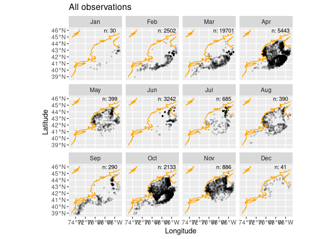
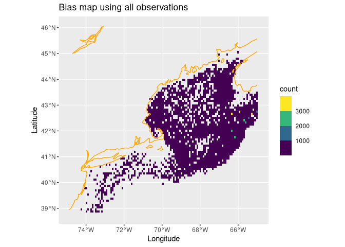

My Second Species
================

## Choosing a Species

For my second species, I am choosing to look at Haddock (scientific name
*Melanogrammus aeglefinus*). Haddock, another benthic species, often
compete with the Atlantic Wolffish, and Atlantic Wolffish are often the
bycatch of haddock fisheries.

## Setting the Scene

``` r
obs = read_observations("Melanogrammus aeglefinus")

coast = read_coastline()
db = brickman_database() |>
  filter(scenario == "STATIC", var == "mask")
mask = read_brickman(db)
```

## Lets Get Started

We will start by counting the number of observations per month

``` r
all_counts = count(st_drop_geometry(obs), month)
```

We will now Create a graph with the selected latitudes and longitudes

``` r
LON0 = -67
LAT0 = 46
ggplot() +
  geom_sf(data = obs, alpha = 0.2, shape = "circle small", size = 1) +
  geom_sf(data = coast, col = "orange") +
  geom_text(data = all_counts,
            mapping = aes(x = LON0, 
                          y = LAT0, 
                          label = sprintf("n: %i", .data$n)),
            size = 3) + 
  labs(x = "Longitude", y = "Latitude", title = "All observations") +
  facet_wrap(~month)
```

<!-- --> We
are now going to thin the observations, and create a count.

``` r
thinned_obs = sapply(month.abb,
                     function(mon){ 
                       temp_x = obs |> filter(month == mon)
                       if(nrow(temp_x) ==0) return(NULL)
                       thin_by_cell(temp_x, mask)
                     }, simplify = FALSE) |>
  dplyr::bind_rows() 
thinned_counts = count(st_drop_geometry(thinned_obs), month)
```

We are now going to create a bias map.

``` r
bias_map = rasterize_point_density(obs, mask)

ggplot() +
  geom_stars(data = bias_map, aes(fill = count)) +
  scale_fill_viridis_b(na.value = "transparent") +
  geom_sf(data = coast, col = "orange") + 
  labs(x = "Longitude", y = "Latitude", title = "Bias map using all observations")
```

<!-- -->

We are now going to figure out how many background points to use, by
averaging the total over the 12 months, and then randomly sample for the
background using our thinned observations and bias map.

``` r
nback_avg = mean(all_counts$n) |>
  round()

obsbkg = sapply(month.abb,
                function(mon){
                  temp_x = thinned_obs |> filter(month == mon)
                  if(nrow(temp_x) == 0) return(NULL)
                  sample_background(temp_x, # <- just this month
                                    mask,
                                    method = "random",  # <-- it needs to know it's a bias map
                                    return_pres = TRUE, # <-- give me the obs back, too
                                    n = nback_avg) |>   # <-- how many points
                    mutate(month = mon, .before = 1)
                }, simplify = FALSE) |>
  bind_rows() |>
  mutate(month = factor(month, levels = month.abb))
```

Like before we are going to drop the geometry and count the total
background and presence data for each month, we are then going to open
the data in the pipe, create 20 different groups based on month and
class, and then randomly sample 1 point.

``` r
count(st_drop_geometry(obsbkg), month, class)
```

    ## # A tibble: 24 × 3
    ##    month class          n
    ##    <fct> <fct>      <int>
    ##  1 Jan   presence      25
    ##  2 Jan   background  2978
    ##  3 Feb   presence     214
    ##  4 Feb   background  2978
    ##  5 Mar   presence     325
    ##  6 Mar   background  2978
    ##  7 Apr   presence    1122
    ##  8 Apr   background  2978
    ##  9 May   presence     312
    ## 10 May   background  2978
    ## # ℹ 14 more rows

``` r
sampled_data = obsbkg |>
  group_by(month, class) |>
  slice_sample(n=1) 
```

After rereading in the Brickman database, and the covariates, we will
add the covariates to our randomly selected points

``` r
db = brickman_database() |> 
  filter(scenario == "PRESENT", interval == "mon")

covars = read_brickman(db, add = "depth")

result = sampled_data |>
  group_by(month) |>
  group_map(
    function(rows, keys){
      if(nrow(rows) == 0) return(NULL)
      brick = slice(covars, "month", rows$month[1])
      values = extract_brickman(brick, rows, form = "wide")
      return(values)
    }, .keep = TRUE
  ) |>
  bind_rows() |>
  select(-.id)

result
```

    ## Simple feature collection with 24 features and 11 fields
    ## Geometry type: POINT
    ## Dimension:     XY
    ## Bounding box:  xmin: -73.08189 ymin: 39.53781 xmax: -65.5 ymax: 44.80269
    ## Geodetic CRS:  WGS 84
    ## # A tibble: 24 × 12
    ##    month class     depth   MLD  Sbtm   SSS   SST  Tbtm        U        V    Xbtm
    ##    <fct> <fct>     <dbl> <dbl> <dbl> <dbl> <dbl> <dbl>    <dbl>    <dbl>   <dbl>
    ##  1 Jan   presence   94.2 19.8   33.7  30.4  3.83  6.44 -1.28e-2 -1.57e-2 0.00731
    ##  2 Jan   backgro… 3941.  57.1   34.9  34.2 13.8   2.17 -4.54e-3  4.90e-5 0.00161
    ##  3 Feb   presence  856.  18.0   34.9  31.3  3.26  4.53 -1.13e-2 -3.78e-2 0.0150 
    ##  4 Feb   backgro…  189.  40.0   34.6  31.1  2.50  7.41 -2.05e-3  8.67e-3 0.00317
    ##  5 Mar   presence   93.0 35.2   32.9  31.2  2.34  5.33  4.79e-3 -1.45e-3 0.00178
    ##  6 Mar   backgro…  223.  23.7   34.7  30.8  1.87  7.50 -4.06e-3 -9.44e-4 0.00148
    ##  7 Apr   presence  100.  17.6   32.7  30.7  3.02  4.61 -6.50e-3 -5.63e-4 0.00232
    ##  8 Apr   backgro…   58.6 14.8   31.5  31.1  5.13  3.91 -2.58e-2 -5.29e-3 0.00967
    ##  9 May   presence   93.0  6.60  32.5  30.4  7.62  4.90 -6.36e-4  3.20e-3 0.00116
    ## 10 May   backgro…   51.7  4.62  31.4  30.2 10.8   5.52 -3.30e-3  3.01e-3 0.00158
    ## # ℹ 14 more rows
    ## # ℹ 1 more variable: geometry <POINT [°]>
