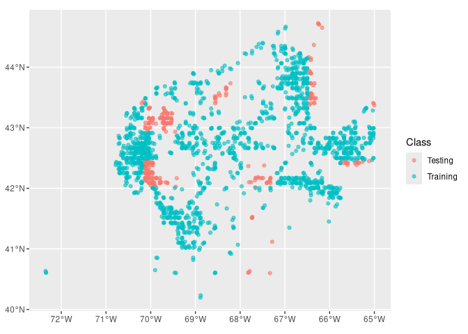
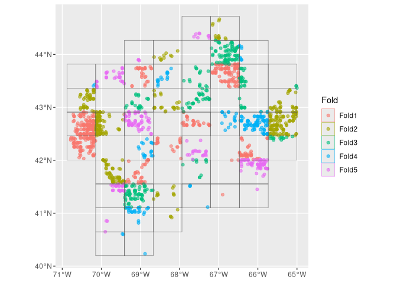
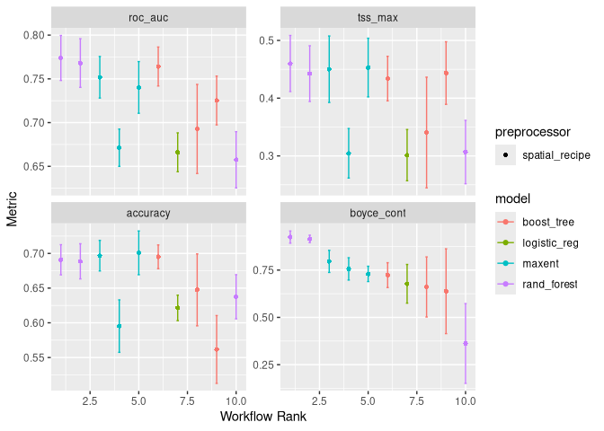
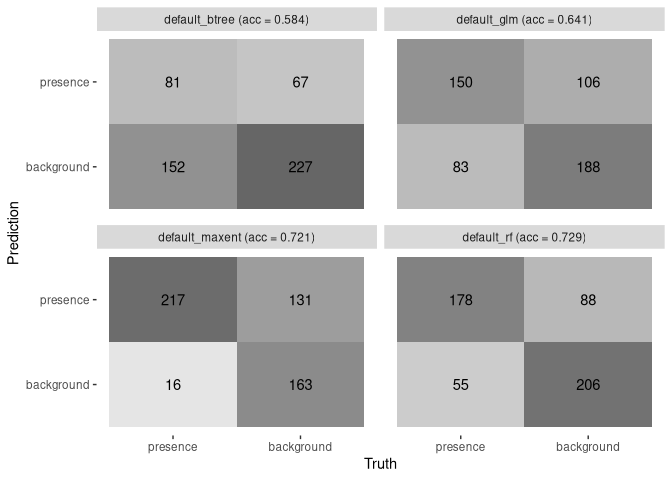
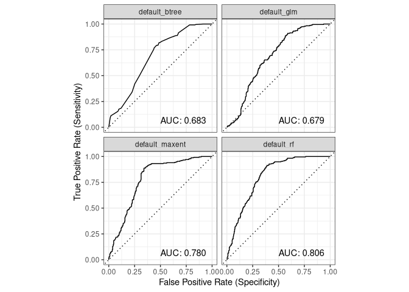
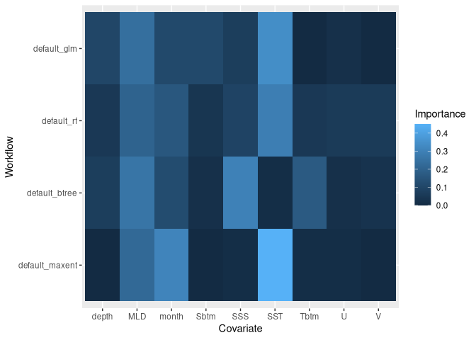
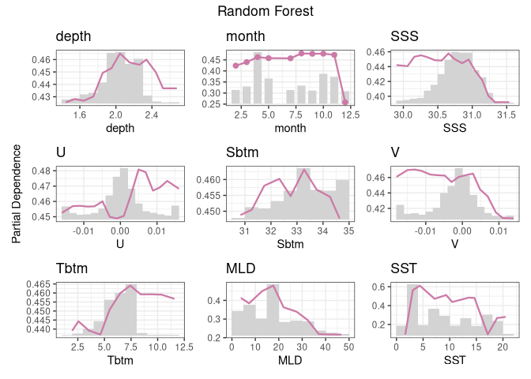

Wolffish Models
================

\#Examining the Split

After having split the data into training and testing data, here is a
spacial image of the training and testing data.
<!-- -->

We then split the training data into different mini-datasets for
training shown here:
<!-- -->

\#Planning the Analysis

Now that we have the data all split up, we are going to create a recipe
that defines what the different variables signify (predictor,
coordinates, and outcomes).

    ## # A tibble: 12 × 4
    ##    variable type      role      source  
    ##    <chr>    <list>    <chr>     <chr>   
    ##  1 depth    <chr [2]> predictor original
    ##  2 month    <chr [2]> predictor original
    ##  3 SSS      <chr [2]> predictor original
    ##  4 U        <chr [2]> predictor original
    ##  5 Sbtm     <chr [2]> predictor original
    ##  6 V        <chr [2]> predictor original
    ##  7 Tbtm     <chr [2]> predictor original
    ##  8 MLD      <chr [2]> predictor original
    ##  9 SST      <chr [2]> predictor original
    ## 10 X        <chr [2]> coords    original
    ## 11 Y        <chr [2]> coords    original
    ## 12 class    <chr [3]> outcome   original

With our variables all defined, we can begin preparing the analysis by
defining the workflows for the different models: - Logistic Regression -
Random Forest - Boosted Tree - Max Entropy

And also our different success metrics: - Accuracy - Boyce Continuous -
Area Under the Curve - TSS

These metrics will help the models determine the accuracy and attempt to
maximize their correctness, allowing them to adjust their
hyperparameters.

\#Picking the Best

The results of the different models and there successes across the
different metrics are shown here:
<!-- -->

We then select the best configuration of hyperparameters for each model
so we can better analyze the models success. From this we can pull
summary statistics:

    ## → A | warning: `early_stop` was reduced to 0.

    ## There were issues with some computations   A: x1There were issues with some computations   A: x1

    ## # A tibble: 4 × 5
    ##   wflow_id       accuracy boyce_cont roc_auc tss_max
    ##   <chr>             <dbl>      <dbl>   <dbl>   <dbl>
    ## 1 default_glm       0.641      0.435   0.679   0.318
    ## 2 default_rf        0.729      0.977   0.806   0.526
    ## 3 default_btree     0.584      0.740   0.683   0.331
    ## 4 default_maxent    0.721      0.812   0.780   0.545

Confusion Matrices:
<!-- -->

And AUC Plots:
<!-- -->

``` r
model_fit_varimp_plot(model_fits)
```

<!-- -->

\#Examining the Random Forest Using the same testing and training data
from earlier:
<!-- -->

The random forest used the metrics we set to tune for the best
hyperparameters, which had these metrics associated with them:

    ## # A tibble: 4 × 4
    ##   .metric    .estimator .estimate .config        
    ##   <chr>      <chr>          <dbl> <chr>          
    ## 1 accuracy   binary         0.729 pre0_mod0_post0
    ## 2 boyce_cont binary         0.977 pre0_mod0_post0
    ## 3 roc_auc    binary         0.806 pre0_mod0_post0
    ## 4 tss_max    binary         0.526 pre0_mod0_post0

And then created these predictions:

    ## # A tibble: 527 × 6
    ##    class      .pred_class .pred_presence .pred_background  .row .config        
    ##    <fct>      <fct>                <dbl>            <dbl> <int> <chr>          
    ##  1 presence   presence            0.710             0.290     2 pre0_mod0_post0
    ##  2 presence   presence            0.663             0.337    10 pre0_mod0_post0
    ##  3 background background          0.147             0.853    17 pre0_mod0_post0
    ##  4 background background          0.223             0.777    18 pre0_mod0_post0
    ##  5 background background          0.0936            0.906    28 pre0_mod0_post0
    ##  6 background background          0.168             0.832    30 pre0_mod0_post0
    ##  7 background background          0.0810            0.919    32 pre0_mod0_post0
    ##  8 background background          0.167             0.833    34 pre0_mod0_post0
    ##  9 background background          0.110             0.890    40 pre0_mod0_post0
    ## 10 background background          0.0802            0.920    42 pre0_mod0_post0
    ## # ℹ 517 more rows

Here is the overall workflow for the random forest model:

    ## ══ Workflow [trained] ══════════════════════════════════════════════════════════
    ## Preprocessor: Recipe
    ## Model: rand_forest()
    ## 
    ## ── Preprocessor ────────────────────────────────────────────────────────────────
    ## 0 Recipe Steps
    ## 
    ## ── Model ───────────────────────────────────────────────────────────────────────
    ## Ranger result
    ## 
    ## Call:
    ##  ranger::ranger(x = maybe_data_frame(x), y = y, mtry = min_cols(~1L,      x), num.trees = ~2000L, importance = ~"impurity", num.threads = 1,      verbose = FALSE, seed = sample.int(10^5, 1), probability = TRUE) 
    ## 
    ## Type:                             Probability estimation 
    ## Number of trees:                  2000 
    ## Sample size:                      1576 
    ## Number of independent variables:  9 
    ## Mtry:                             1 
    ## Target node size:                 10 
    ## Variable importance mode:         impurity 
    ## Splitrule:                        gini 
    ## OOB prediction error (Brier s.):  0.2314177

\#Partial Dependence Plot

We then created a partial dependence plot for the best performing model…
the random forest model
<!-- -->
