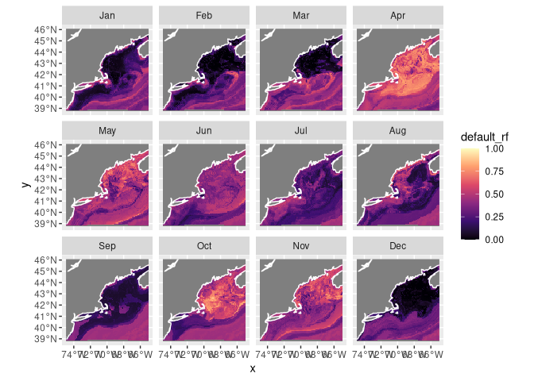
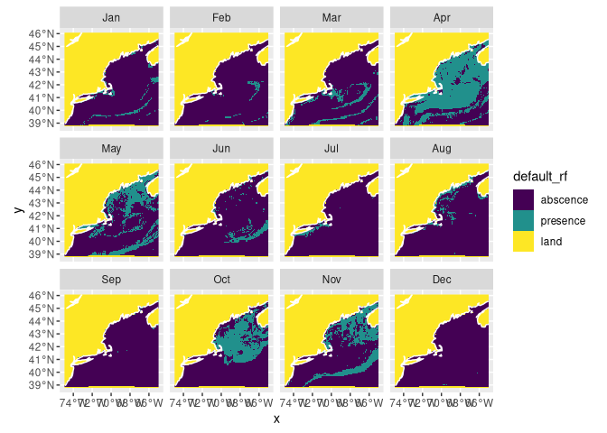
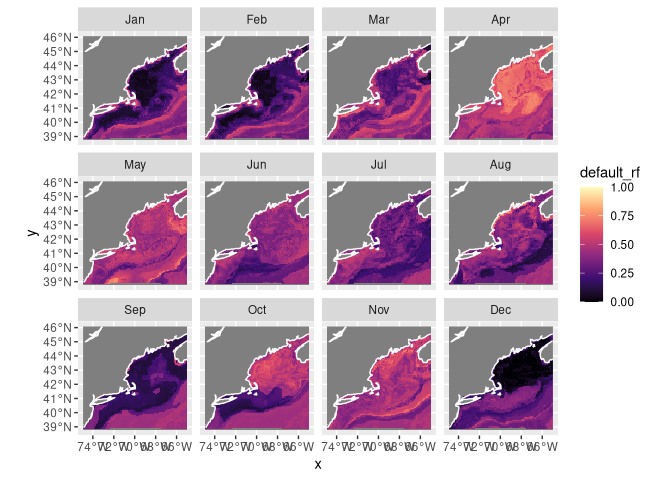
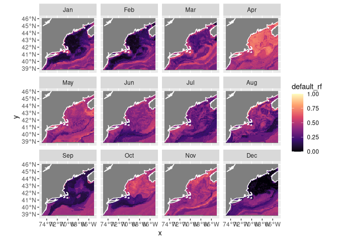
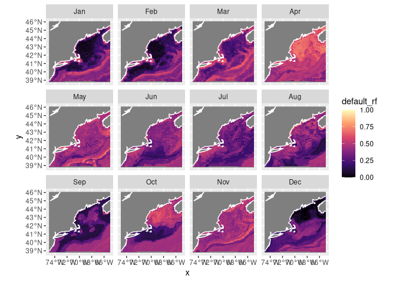

Wolffish Predictions
================

\#Creating the Nowcast

Here is the nowcast projection:

    ## numeric

<!-- -->

Here is the nowcast presence and absence projections:
<!-- -->

\#Creating the Forecasts for 2055

Here is the forecast for the year 2055 under the RCP45 conditions
(greenhouse emissions taper after the year 2040):

    ## numeric

<!-- -->

Here is the forecast for the year 2055 under the RCP85 conditions
(greenhouse emissions continue as is):

    ## numeric

<!-- -->

\#Creating the Forecasts for 2075

Here is the forecast for the year 2075 under the RCP45 conditions
(greenhouse emissions taper after the year 2040):

    ## numeric

<!-- -->

Here is the forecast for the year 2075 under the RCP85 conditions
(greenhouse emissions continue as is):

    ## numeric

<!-- -->
